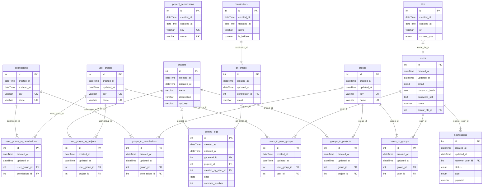

# GitFit

Collect and analyze developers activity on projects.

## 1. Introduction

### 1.1 Useful Links

- [Project specification](./docs/specification.md).
- Pay attention, that we have certain [quality criteria](https://github.com/BinaryStudioAcademy/quality-criteria/blob/production/src/javascript.md), which we should follow during application development.

## 2. Domain

The application collects and analyzes developers' activity on different projects based on GIT commits.

## 3. Requirements

- [NodeJS](https://nodejs.org/en) (20.x.x);
- [npm](https://www.npmjs.com/) (10.x.x);
- [PostgreSQL](https://www.postgresql.org/) (16.4)

## 4. Database Schema



## 5. Architecture

TBD

### 5.1 Global

#### 5.1.1 Technologies

1. [Typescript](https://www.typescriptlang.org/)
2. [npm workspaces](https://docs.npmjs.com/cli/v9/using-npm/workspaces)

### 5.2 Frontend

#### 5.2.1 Technologies

1. [React](https://react.dev/) — a frontend library
2. [Redux](https://redux.js.org/) + [Redux Toolkit](https://redux-toolkit.js.org/) — a state manager

#### 5.2.2 Folder Structure

1. assets - static assets (images, global styles)
2. libs - shared libraries and utilities

   2.1 components - plain react components

   2.2 enums

   2.3 helpers

   2.4 hooks

   2.5 modules - separate features or functionalities

   2.6 types

3. modules - separate app features or functionalities
4. pages - app pages

### 5.3 Backend

#### 5.3.1 Technologies

1. [Fastify](https://fastify.dev/) — a backend framework
2. [Knex](https://knexjs.org/) — a query builder
3. [Objection](https://vincit.github.io/objection.js/) — an ORM

#### 5.3.2 Folder Structure

1. db - database data (migrations, seeds)
2. libs - shared libraries and utilities

   2.1 enums

   2.2 exceptions

   2.3 helpers

   2.4 modules - separate features or functionalities

   2.5 types

3. modules - separate app features or functionalities

### 5.4 Shared Package

#### 5.4.1 Reason

As we are already using js on both frontend and backend it would be useful to share some contracts and code between them.

#### 5.4.2 Technologies

1. [Zod](https://github.com/colinhacks/zod) — a schema validator

## 6. How to Run

### 6.1 Manually

1. Create and fill all .env files. These files are:

- apps/frontend/.env
- apps/backend/.env

You should use .env.example files as a reference.

1. Install dependencies: `npm install`.

2. Install pre-commit hooks: `npx simple-git-hooks`. This hook is used to verify code style on commit.

3. Build shared: `npm run build:shared`

4. Run database. You can run it by installing postgres on your computer.

5. Apply migrations: `npm run migrate:dev -w apps/backend`

6. Run backend: `npm run start:dev -w apps/backend`

7. Run frontend: `npm run start:dev -w apps/frontend`

## 7. Development Flow

### 7.1 Pull Request Flow

```
<type>: <ticket-title> <project-prefix>-<issue-number>
```

For the full list of types check [Conventional Commits](https://github.com/conventional-changelog/commitlint/tree/master/%40commitlint/config-conventional)

Examples:

- `feat: add dashboard screen gf-123`

### 7.2 Branch Flow

```
<issue-number>-<type>-<short-desc>
```

Examples:

- `123-feat-add-dashboard`
- `12-feat-add-user-flow`
- `34-fix-user-flow`

### 7.3 Commit Flow

We use [Conventional Commits](https://www.conventionalcommits.org/en/v1.0.0) to handle commit messages

```
<type>: <description> <project-prefix>-<issue-number>
```

Examples:

- `feat: add dashboard component gf-45`
- `fix: update dashboard card size gf-212`

## 8. Deployment

CI/CD implemented using [GitHub Actions](https://docs.github.com/en/actions)
